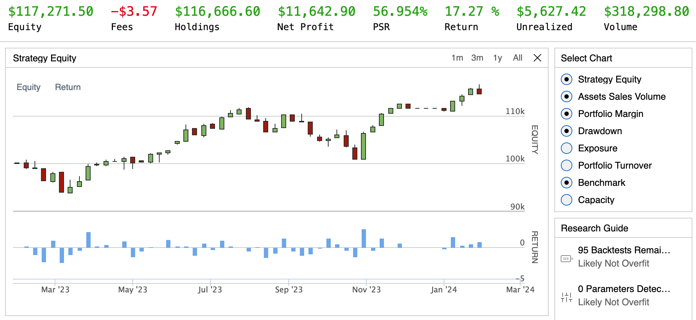
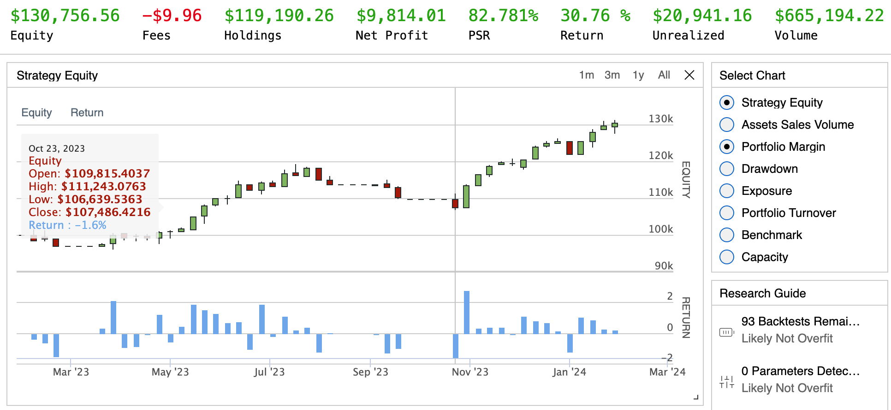
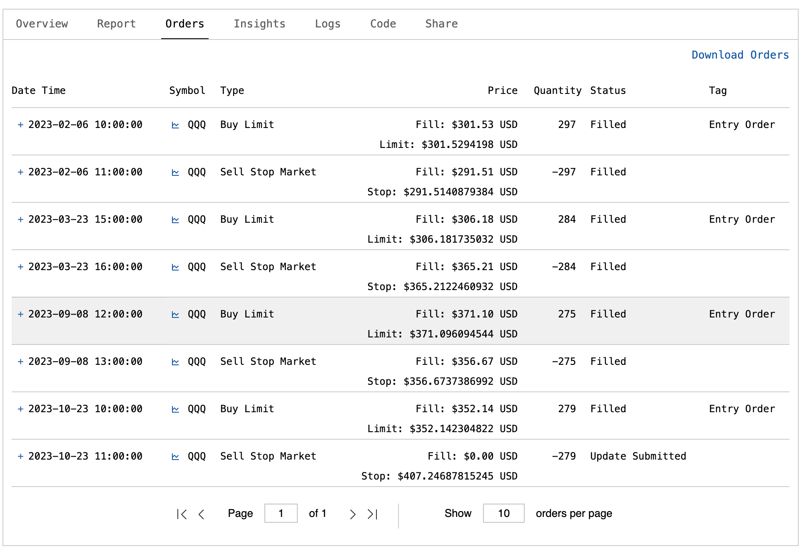

# Samuel Margerison - Algorithmic Trading Bots

This project documents my journey in learning about the QuantConnect API and it's features.

## Introductory Bot Build

The `intro-bot` buys SPY when not already invested and the current time meets or exceeds a predefined entry time, calculating the number of shares to purchase based on available cash and current price. It sells SPY if the current price is either 10% above or 10% below the entry price, resetting the next entry time after selling. The algorithm operates from February 3, 2023, to February 3, 2024, with an initial cash allocation of $100,000, using Interactive Brokers as the brokerage model under a margin account.

## Trailing Stop Loss Build

Operates within a specified time frame from February 5, 2023, to February 5, 2024, starting with a cash allocation of $100,000. The algorithm trades QQQ at an hourly resolution.

Initialization: During initialization, the algorithm sets up the trading environment, including start/end dates, initial cash, adding QQQ as an equity asset, and initializing variables for tracking entry tickets, stop market orders, fill times, and the highest price observed.
Trading Logic:
Entry Condition: If the portfolio is not currently invested and there are no open orders for QQQ, the algorithm calculates the quantity of shares to buy based on 90% of the portfolio's cash and places a limit order at the current price. If this limit order is not filled within one day, the algorithm increases the limit price to the current market price.
Stop Loss Adjustment: If the portfolio holds positions in QQQ, the algorithm continuously adjusts a trailing stop loss order. It moves the stop loss price up if the current price exceeds the previously recorded highest price, setting the stop loss at 95% of the highest observed price.
Order Events Handling: Upon order fill events, the algorithm places a stop loss order once the entry limit order is filled, selling the acquired shares at 95% of the average fill price of the entry order. It also resets the highest price observed to zero once the stop loss order is filled.
Cooldown Period: After closing a position through the stop loss order, the algorithm waits 30 days before starting to invest again, preventing rapid succession of trades without sufficient market observation.

### List of Orders

