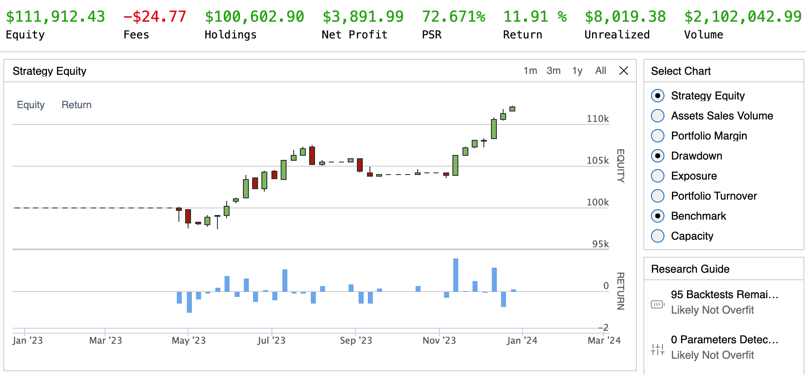
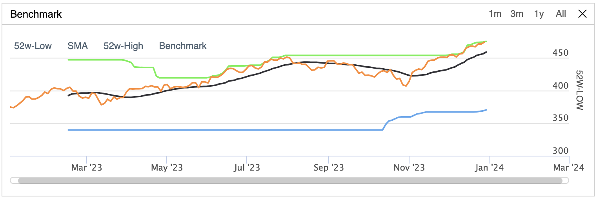

# Samuel Margerison - Algorithmic Trading Bots

This project documents my journey in learning about the QuantConnect API and it's features.

## Introductory Bot Build

The `intro-bot` buys SPY when not already invested and the current time meets or exceeds a predefined entry time, calculating the number of shares to purchase based on available cash and current price. It sells SPY if the current price is either 10% above or 10% below the entry price, resetting the next entry time after selling. The algorithm operates from February 3, 2023, to February 3, 2024, with an initial cash allocation of $100,000, using Interactive Brokers as the brokerage model under a margin account.

## Trailing Stop Loss Build

Operates within a specified time frame from February 5, 2023, to February 5, 2024, starting with a cash allocation of $100,000. The algorithm trades QQQ at an hourly resolution.

### Initialization:
 During initialization, the algorithm sets up the trading environment, including start/end dates, initial cash, adding QQQ as an equity asset, and initializing variables for tracking entry tickets, stop market orders, fill times, and the highest price observed.
Trading Logic:
### Entry Condition:
 If the portfolio is not currently invested and there are no open orders for QQQ, the algorithm calculates the quantity of shares to buy based on 90% of the portfolio's cash and places a limit order at the current price. If this limit order is not filled within one day, the algorithm increases the limit price to the current market price.
### Stop Loss Adjustment: 
If the portfolio holds positions in QQQ, the algorithm continuously adjusts a trailing stop loss order. It moves the stop loss price up if the current price exceeds the previously recorded highest price, setting the stop loss at 95% of the highest observed price.
Order Events Handling: Upon order fill events, the algorithm places a stop loss order once the entry limit order is filled, selling the acquired shares at 95% of the average fill price of the entry order. It also resets the highest price observed to zero once the stop loss order is filled.
### Cooldown Period:
 After closing a position through the stop loss order, the algorithm waits 30 days before starting to invest again, preventing rapid succession of trades without sufficient market observation.

### List of Orders

## Uptrend and Downtrend Detector Build

The algorithm initializes by setting the trading period from January 1, 2023, to January 1, 2024, with an initial cash allocation of $100,000. It subscribes to daily price data for SPY and implements a custom SMA indicator over a 30-day period. The custom SMA class, CustomSimpleMovingAverage, maintains a rolling queue of closing prices and calculates the average whenever updated with new price data.

In the on_data method, which processes incoming market data, the algorithm performs several actions:

-   It waits until the SMA indicator has accumulated enough data (30 days) before proceeding.
-   Retrieves historical price data for SPY over the past 365 days to determine the highest and lowest prices during this period.
-   Based on the current price relative to these historical levels and the SMA value, the algorithm decides whether to enter a long position(if the price is within 5% of the 365-day high and the SMA is below the current price) or a short position (if the price is within 5% of the 365-day low and the SMA is above the current price).
-   If neither condition is met, any existing positions are liquidated.
-   The algorithm also plots the 52-week high, 52-week low, and the current SMA value for visualization purposes.

Key points include:

-   Use of historical price data to identify potential entry points based on relative strength or weakness over the past year.
-   Implementation of a custom SMA indicator to filter trading signals, aiming to enter trades only when the trend direction aligns with the strategy's conditions.
-   Dynamic adjustment of portfolio holdings based on real-time market data and predefined criteria, with the ability to go long, short, or exit positions entirely.
-   Visualization of key metrics (52w-High, 52w-Low, SMA) to aid in understanding the strategy's performance and decision-making process over time.

### Benchmark Graph

